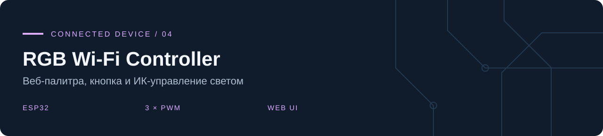
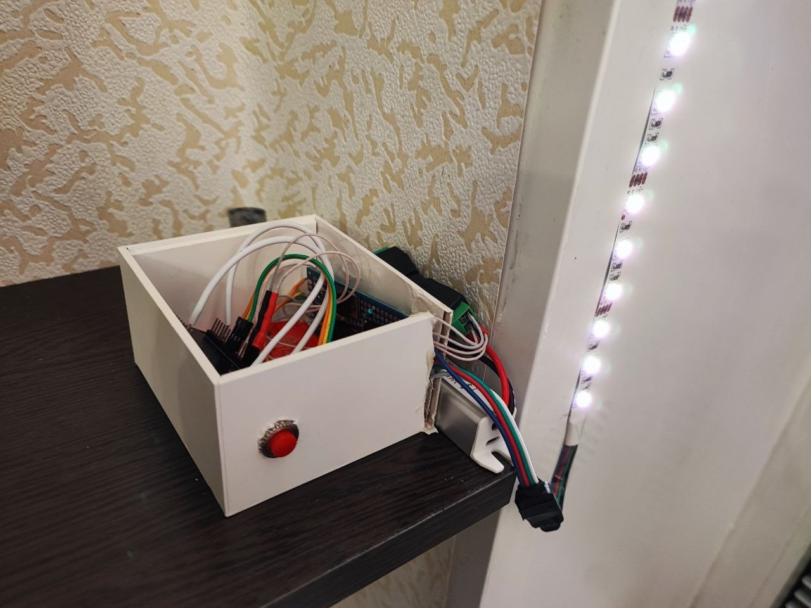
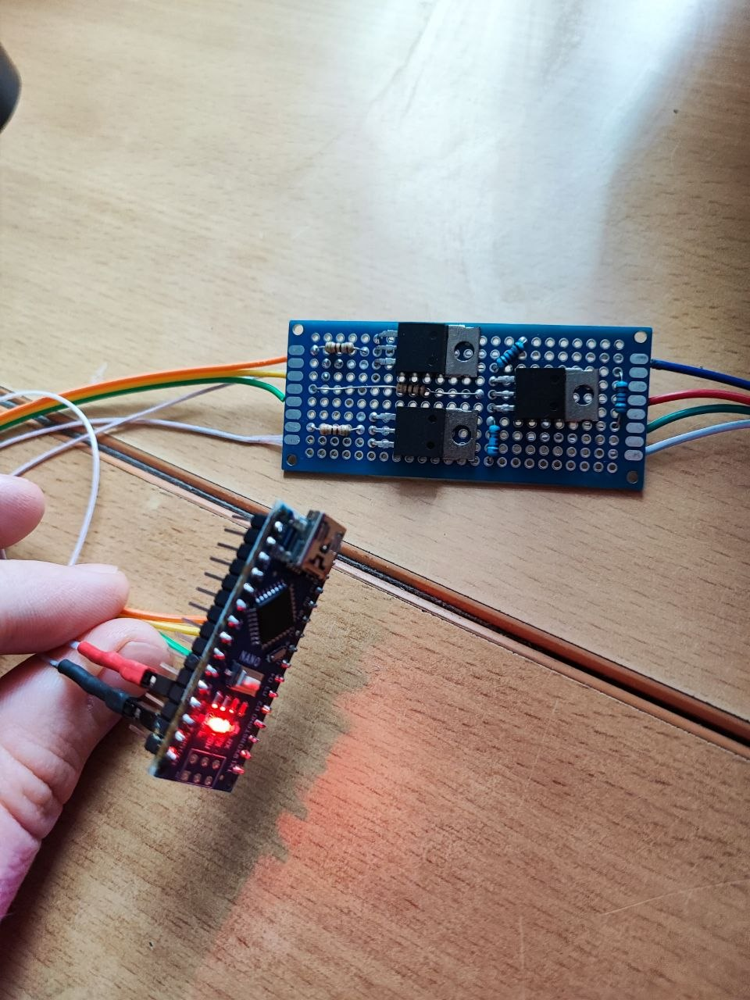
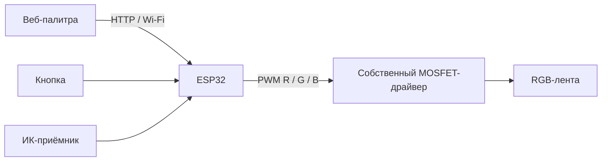

**Владислав Чернухин** · [Инженерное портфолио](https://github.com/TzarRusi)

Контроллер RGB-ленты на ESP32 с выбором цвета через браузер. В одном скетче объединены веб-интерфейс, аппаратный PWM, физическая кнопка и ИК-приёмник.

**Собранное работающее устройство: от прототипа на Arduino до версии на ESP32 с собственноручно изготовленным силовым модулем на MOSFET.**

## Устройство в работе

*Версия на ESP32: контроллер в корпусе, кнопка на передней панели и подключённая RGB-лента в работе.*

## От прототипа к устройству

| Этап | Результат |
|---|---|
| Прототип на Arduino Nano | Макет управления RGB-лентой с внешним силовым модулем |
| Собственный MOSFET-драйвер | Вручную собранный и спаянный трёхканальный модуль на макетной плате для каналов R, G и B |
| Устройство на ESP32 | Сборка в корпусе, подключение ленты и управление по Wi-Fi; в прошивке предусмотрены кнопка и ИК-приёмник |

  

<em>Ранний прототип: Arduino Nano и отдельная плата драйвера с тремя MOSFET. Силовой модуль изготовлен и спаян вручную.</em>

## Архитектура

| Функция | Реализация |
|---|---|
| Веб-палитра | HTML Canvas, выбор цвета мышью или касанием |
| Сервер | `WebServer`, HTTP порт 80 |
| RGB PWM | GPIO 26 / 27 / 25; 10 кГц, 8 бит |
| Кнопка | GPIO 35, обработчик прерывания и EncButton |
| ИК-приёмник | GPIO 5, IRremote |
| Индикатор | GPIO 2 |

GPIO35 у классического ESP32 не имеет внутренней подтяжки: для кнопки требуется внешняя цепь, согласованная со схемой. Для ленты используется внешний силовой драйвер и отдельное подходящее питание с общей землёй.

## Подготовка и запуск

1. Откройте `RGBWifiButton.ino` в одноимённом каталоге Arduino.
2. Установите Arduino-ESP32 2.x и совместимые версии `IRremote`, `EncButton`, `NTPClient`, `Time`, `GyverTimer`. Проект использует старые API LEDC и IRremote; версии библиотек в архиве не закреплены.
3. Скопируйте `secrets.example.h` в `secrets.h`, впишите настройки своей Wi-Fi-сети.
4. Проверьте назначение выводов, соберите и загрузите прошивку по USB. Откройте IP устройства в браузере той же сети.

## Статус

Проект реализован в железе: собран прототип на Arduino, изготовлен MOSFET-драйвер и создано работающее устройство на ESP32. Фотографии показывают оба этапа. В репозитории опубликована прошивка версии на ESP32; настройки Wi-Fi вынесены в локальный файл `secrets.h`.

Документация совместимости: [Arduino-ESP32 2.x → 3.0](https://docs.espressif.com/projects/arduino-esp32/en/latest/migration_guides/2.x_to_3.0.html).
