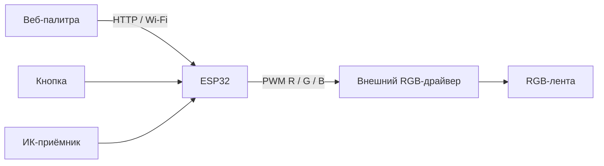

**Владислав Чернухин** · [Инженерное портфолио](https://github.com/TzarRusi)

Контроллер RGB-ленты на ESP32 с выбором цвета через браузер. В одном скетче объединены веб-интерфейс, аппаратный PWM, физическая кнопка и ИК-приёмник.

## Архитектура

| Функция | Реализация |
|---|---|
| Веб-палитра | HTML Canvas, выбор цвета мышью или касанием |
| Сервер | `WebServer`, HTTP порт 80 |
| RGB PWM | GPIO 26 / 27 / 25; 10 кГц, 8 бит |
| Кнопка | GPIO 35, обработчик прерывания и EncButton |
| ИК-приёмник | GPIO 5, IRremote |
| Индикатор | GPIO 2 |

GPIO35 у классического ESP32 не имеет внутренней подтяжки: для кнопки требуется внешняя цепь, согласованная со схемой. Для ленты используется внешний силовой драйвер и отдельное подходящее питание с общей землёй.

## Подготовка и запуск

1. Откройте `RGBWifiButton.ino` в одноимённом каталоге Arduino.
2. Установите Arduino-ESP32 2.x и совместимые версии `IRremote`, `EncButton`, `NTPClient`, `Time`, `GyverTimer`. Проект использует старые API LEDC и IRremote; версии библиотек в архиве не закреплены.
3. Скопируйте `secrets.example.h` в `secrets.h`, впишите настройки своей Wi-Fi-сети.
4. Проверьте назначение выводов, соберите и загрузите прошивку по USB. Откройте IP устройства в браузере той же сети.

## Статус

Архивный pet-проект, демонстрирующий интеграцию периферии и веб-управления. Исходный код сохранён, сетевые реквизиты вынесены в локальный файл. При подготовке портфолио выполнен статический просмотр; сборка и стендовая проверка не выполнялись. Перед повторением требуется проверить согласование шкалы веб-палитры с 8-битным PWM и полярность конкретного RGB-драйвера.

Документация совместимости: [Arduino-ESP32 2.x → 3.0](https://docs.espressif.com/projects/arduino-esp32/en/latest/migration_guides/2.x_to_3.0.html).
